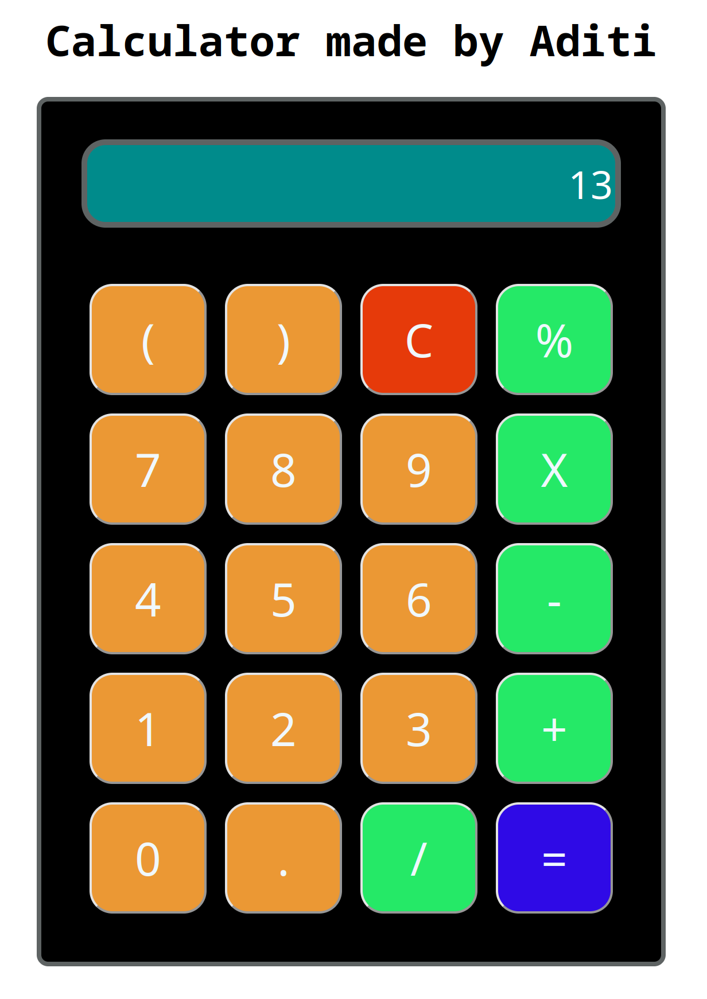

# simple-calculator

A simple calculator using HTML. CSS and JS. It can handle basic addition, multiplication, subtraction etc, division like any other calculator.

 

Go to the link below to use the calculator:

https://aditiii-simplecalculator.netlify.app/
